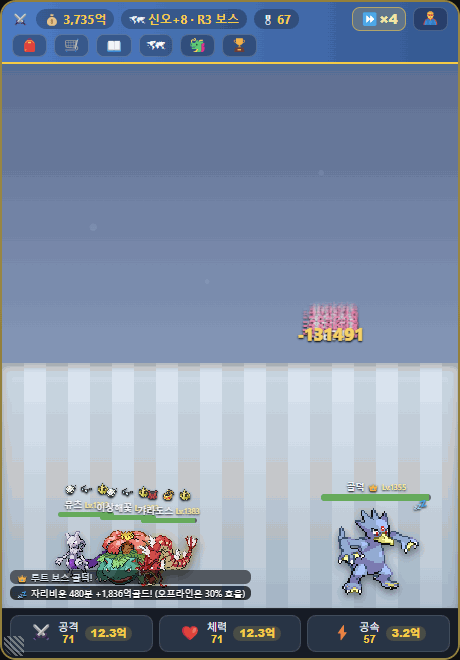

# 포켓몬 배틀룸 🔴

바탕화면에 작게 띄워놓고 자동으로 굴러가는 **방치형 포켓몬 오토배틀러** (Electron 데스크톱 앱).
파티 3마리를 꾸려 관동부터 차례차례 지방을 정복하고, 레이드·온라인 랭킹·이로치·개체치까지 파고드는 아이들 RPG입니다. 1세대 151마리 전부 등장합니다.

<p align="center"></p>

<p align="center"><a href="https://github.com/lie-0022/pokemon-battle-room/releases/latest"><b>⬇️ 최신 버전 다운로드 (Windows / Mac)</b></a></p>

> 모든 데이터는 공식 [PokéAPI](https://pokeapi.co)의 실제 포켓몬 데이터(종족값·타입·기술·진화·스프라이트)입니다.

---

## 📥 설치 / 실행

### 사용자 (설치본)
[Releases](https://github.com/lie-0022/pokemon-battle-room/releases/latest)에서 최신 버전을 받으세요.

- **Windows**: `PokemonRoom-<버전>-win.exe` 실행 → SmartScreen 경고 시 "추가 정보" → "실행"
- **Mac**: `PokemonRoom-<버전>-mac.dmg` 열고 앱을 Applications로 드래그 → "손상됨" 경고 시 터미널에서
  `xattr -cr /Applications/PokemonBattleRoom.app` 후 우클릭 → 열기

> 기존 설치 위에 새 버전을 실행하면 그대로 업데이트되며 **진행 데이터는 보존**됩니다.

### 개발자
```bash
npm install   # 최초 1회
npm start     # 앱 실행 (트레이 상주 + 배틀룸 창)
npm run dist  # Windows 설치본 빌드 (dist/)
```

---

## 🎮 게임 개요

화면 하단에 도킹되는 작은 창에서 파티가 **자동 전투**합니다. 트레이(시스템 알림 영역) 아이콘에 상주하며, 켜두면 알아서 진행되는 방치형입니다.

- **지방 정복** — 관동→성도→…8지방 순환, 각 지방은 6루트 × 웨이브 + 루트보스, 7번째는 챔피언 관문. 배지를 모으며 무한 진행.
- **파티 & 육성** — 3마리 파티 + 벤치, 레벨업·진화(레벨/돌/통신), 기술 자동/수동 세팅, 개체치(IV) 0~31.
- **장비(도구)** — 몬스터당 3슬롯(메인/부스트/테크). 뽑기·드롭·레이드로 수급, 3개 합성으로 별(등급) 상승. 상한 도구는 초과분이 보조 능력치로 환원.
- **레이드 🐲** — 보유 포켓몬 10마리로 보스 도전. 밴드 구조(일반→정예→전설→지옥, 이후 무한), 타입 상성·시너지 세팅 승부, 팀 프리셋·자동 재도전.
- **온라인 랭킹 🏆** — 레이드 최단시간·스테이지 진행 전세계 랭킹 + 남의 세팅 열람.
- **수집** — 도감 151, 이로치(색이 다른 포켓몬, 야생 1%·이로치사탕 변환), 개체치 31 마스터.

조작·업데이트 내역 등 상세 설명은 앱에 포함된 **`dist/사용법.txt`** 참고.

---

## 🗂 구조

| 파일 | 역할 |
|------|------|
| `main.js` | Electron 메인 — 배틀룸/펫 창 + 트레이 메뉴 + 저장 |
| `preload.js` | 메인 ↔ 렌더러 IPC 다리 |
| `room.html` / `room.css` / `room.js` | **배틀룸** — 전투·육성·장비·레이드·랭킹 등 모든 게임 로직 |
| `pokedex.js` / `gamedata.js` | 도감·기술·타입·진화 임베드 데이터 (PokéAPI 유래) |
| `mac-adhoc-sign.js` | macOS ad-hoc 서명 (afterPack 훅, "손상된 파일" 방지) |
| `pet.html` / `pet.js` | (레거시) 바탕화면 도트 펫 |
| `index.html` / `game.js` | (레거시) 브라우저 턴제 배틀 |

### 세이브
localStorage `pkmnRoom` (앱 저장 폴더 `%APPDATA%\pokemon-desktop-pet`). 버전 마이그레이션으로 구버전 세이브 호환.
`appId`(`com.jayjun.pokemonroom`)·`name`이 고정이라 새 설치본이 기존 설치를 덮어써도 진행이 유지됩니다.

### 빌드 / 배포
- GitHub Actions(`.github/workflows/build.yml`)가 `v*` 태그 푸시 시 Windows(.exe) + macOS(.dmg/.zip)를 빌드해 릴리스에 첨부.
- 설계·밸런스 문서는 [`docs/`](docs/) 참고 (특히 [`06-밸런스-전면-재설계.md`](docs/06-밸런스-전면-재설계.md)).

---

## 📜 라이선스 / 출처

- 포켓몬 데이터·스프라이트: [PokéAPI](https://pokeapi.co) (개인/비상업 사용)
- 포켓몬 및 관련 명칭은 Nintendo / Game Freak / The Pokémon Company의 상표입니다. 본 프로젝트는 학습·개인용 팬 메이드입니다.
